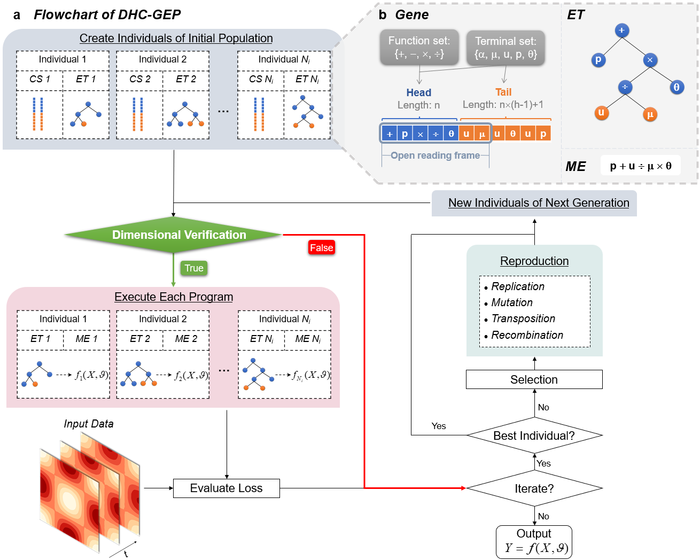
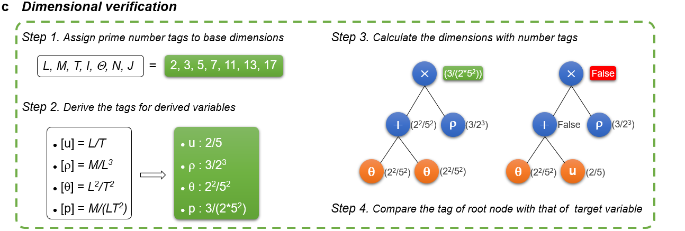

# Dimensional homogeneity constrained gene expression programming for discovering governing equations from noisy and scarce data

## Abstract
Data-driven discovery of governing equations is of great significance for helping us to understand intrinsic mechanisms and explore physical models. However, it is still not trivial for the state-of-the-art algorithms to discover the unknown governing equations for complex systems. In this work, a novel dimensional homogeneity constrained gene expression programming (DHC-GEP) method is proposed. DHC-GEP discovers the forms of functions and their corresponding coefficients simultaneously, without assuming any candidate functions in advance. Its key advantages, including being robust to the hyperparameters of models, the noise level and the size of datasets, are demonstrated on two benchmarks. Furthermore, DHC-GEP is employed to discover the unknown constitutive relations of two typical non-equilibrium flows. The derived constitutive relations not only are more accurate than the conventional constitutive relations, but also satisfy the Galilean invariance and the second law of thermodynamics. DHC-GEP is a general and promising tool for discovering governing equations from noisy and scarce data in a variety of fields, such as non-equilibrium flows as well as neuroscience, epidemiology, turbulence, and non-Newton fluids.

## Main characteristics of DHC-GEP
__Fig. a__ is a __schematic diagram of DHC-GEP__. Initial population is created with $N_i$ random individuals. Each individual has genotype (chromosome (CS)) and phenotype (expression tree (ET)). Each chromosome is composed of one or more genes. Via dimensional verification, all the individuals are classified into valid ones and invalid ones according to whether they satisfy dimensional homogeneity. The valid ones would be translated into mathematical expressions (ME), and be evaluated for losses with input data. The invalid ones would be directly assigned a significant loss. Then, the individuals of next generation are generated with the best individual in this generation and the offspring of the selected superior individuals (with relatively lower losses) through genetic operators. The above processes are iteratively conducted until a satisfying individual is obtained. __Schematic diagram of a gene and its corresponding expression tree and mathematical expression are shown in Fig. b__. A gene can be divided into two parts composed of head and tail. The head consists of the symbols from the function set or terminal set, while the tail only consists of symbols from terminal set. Each gene can be exclusively expressed as an expression tree. The domain expressed is called open reading frame (ORF). The expression tree can be further translated into a mathematical expression.



__Fig. c is a strategy of dimensional verification__: first assign prime number tags to the base dimensions and derive the tags for the derived variables, then calculate the dimension of each node in the expression tree from the bottom up, finally compare the tag of the root node with that of the target variable. If they are the same, it can be concluded that the certain individual is dimensional homogeneous.



## Dependencies
- Python 3.8
- numpy
- geppy
- random
- operator 
- pickle
- fractions
- scipy
- time  

[Anoconda](https://www.anaconda.com/) is recommended for installing the above dependencies.

## How to run  our cases
All the training data are in the 'data' dictionary. 

The scripts are in the corresponding dictionaries. One can run the desired scripts with python.

The best equations of each generation are output in real time to a '.dat' file in the 'Output' dictionary. The latest population is saved every 20 generations to a '.pkl' file in the 'pkl' dictionary for ease of subsequent restarting if necessary. 

## How to assign number tags for the imported terminals
If someone wants to employ DHC-GEP in other problems, one should reassign number tags for the imported terminals. This is implemented in the following codes. One can redefine 'dict_of_dimension' as needed. Key is the name of imported terminal. Value is the number tag.
```
# Assign prime number tags to base dimensions
L,M,T,I,Theta,N,J = 2,3,5,7,11,13,17

# Derive the tags for dirived physical quantities according to their dimensions
# Note that the tags are always in the form of fractions, instead of floats, which avoids introducing any truncation errors. 
# Therefore, we use 'Fraction' function here.
dict_of_dimension = {'rho':Fraction(M,((L)**(3))),
                     'rho_y':Fraction(M,((L)**(4))),
                     'rho_yy':Fraction(M,((L)**(5))),
                     'rho_3y':Fraction(M,((L)**(6))),
                     'df_c':Fraction((L**2),T)} 

# Assign number tags to taget variable
target_dimension = Fraction(M,T*((L)**(3)))
```